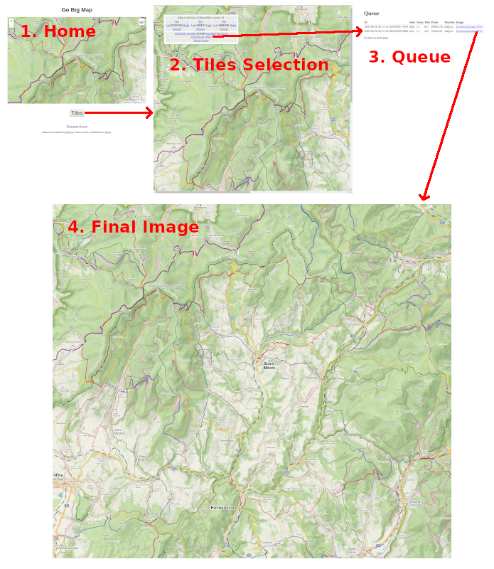

# GoBigMap

This is an reimplementation of [BigMap2](https://github.com/Zverik/bigmap2) in
[golang](https://golang.org/): a tool to stitch map tiles and produce one big
PNG image. And the reasons for yet another tool with the same functionality?

* complex deployment due to mixture of technologies (php, perl, python, cron)
  and need of web server (e.g. apache)
* possibility of fast and easy deployment in cloud as well as start on local
  machine without need to install and configure any dependencies (e.g. web server)
* simple configuration of tile providers (one single file with provider
  definitions)
* joy of coding in golang :-)

## How does it work

Application provides three pages:
1. Home - default page, where you can roughly select area of interest. Once you define
   area you would like to cover by PNG image, click on *Tiles* button to move to
   *Tiles selection*
2. Tiles selection - this page allows you to precisely select zoom factor and
   individual map tiles in both directions (x and y axis). Box with controls
   allows you to perform various operations (Expand, Shrink, Shift, Zoom).
   Browser window displays whole map that will be stitched. Be aware that you
   have to use scroll bars to see parts of map that don't fit to browser window.
   Click on *GENERATE PNG* to start stitching process. Your request will be
   queued and you will be redirected to next queue page.
3. Queue - this page provides information of all requests. Processed requests are
   in state *done* and you can download final image. Old requests are automatically
   removed after defined expiration interval (2 days by default).




## Installation

The whole application runs as standalone server started from binary file.
There are two possibilities how start it. Either you compile server binary from
source files and run it directly or you build docker image and run application
as container. See more details in next two chapters.

### Build and run from source code

Git and golang are required. Refer to [Golang Downloads](https://golang.org/dl/)
for installation instructions.

Clone repository to `gobigmap` directory:
```
git clone https://github.com/mnezerka/gobigmap.git
```

Build server binary:
```
cd gobigmap
go build
```

Server binary `gobigmap` should appear in repository directory. Try to run to verify
it was compiled and linked properly:
```
./gobigmap -h
```

You should see usage information with all parameters that can be provided.

Now you can start the server:
```
./gobigmap
```

If everything goes well, server is started and you can access it from web browser at
local address `http://localhost:9090/`

### Build and run as docker container

All you need is local installation of docker. Clone repository to `gobigmap` directory:
```
git clone https://github.com/mnezerka/gobigmap.git
```

Build image and give it name (tag) `gobigmap`:
```
cd gobigmap
docker build . -t gobigmap
```
This procedure is driven by instructions in Dockerfile. Temporary golang image
is created and once server binary is compiled, it is copied to basic alpine
linux image, which contains just compiled binary, html templates, javascript
scripts and provider definitions (image size ~ 15MB). You should see new image
in docker:
```
docker images | grep gobigmap
```

Now you can start new container as:
```
docker run -p 9090:9090 gobigmap
```

If everything goes well, server is started and you can access it from web browser at
local address `http://localhost:9090/`

## License

All scripts were written by Michal Nezerka, partly based on public domain code by Ilya Zverev.
Published under MIT license.
